# Golem RPC Gateway

A brief description of what this project does and who it's for


## Installation

#### pre-requisites

Install poetry

### Build

`poetry install`

### Configuration

### Run

`poetry run python ethnode_requestor`


### Deploying to production

Warning - project contains submodule for frontend:

Sample script for updating submodules

```bash
#!/bin/bash
echo "Git pull and submodules pull"

git pull
git submodule update
git submodule foreach git checkout main
git submodule foreach git pull origin main
```

docker-compose.yml is production configuration for docker-compose

Sample .env file 

```
# postgres
POSTGRES_USER=postgres 
POSTGRES_PASSWORD=postgres
POSTGRES_DB=gateway
# pgadmin
PGADMIN_DEFAULT_EMAIL=default@gmail.com
PGADMIN_DEFAULT_PASSWORD=pgadminpass
PGADMIN_PORT=5050
PGADMIN_BASE_URL=/mumbai-db
# gateway
MONITOR_DB_ENGINE=postgres
ETHNODE_PORT=9001
GATEWAY_BASE_URL=https://your.server/api
SUBNET=golem_test_subnet
NUM_INSTANCES=3
ALLOWED_ENDPOINT=mumbai
# yagna and gateway
YAGNA_MON_PORT=3334
YAGNA_APPKEY=aaaaaaaaaaaaaaaaaaaaaaaaaaaaaaaa
# yagna only
YAGNA_AUTOCONF_ID_SECRET=YOUR_PRIVATE_ETH_KEY
ADDR=YOUR_PRIVATE_ADDR_ETH
# frontend
FRONTEND_PORT=5031
```

```
Additionaly create pg_admin directory for pg_admin
Owner ID of that folder 5050:5050 (user that pg admin is using in docker)
```

Additional nginx setup is needed for your server to work

## Architecture outline

The most general premise is that the platform delivered by Golem can serve as
gateway that the Reality NFT clients can use to connect to the Ethereum network,
without relying on a self-maintained network of Ethereum nodes.



### Reality NFT clients

The clients in the Reality NFT ecosystem are third-party web3 clients, or in other words, 
applications that require interaction with the Ethereum network, e.g. to query the
blockchain or to send transactions.

### Golem RPC Gateway

Golem RPC Gateway exposes the endpoint that the Reality NFT clients use as their
web3 back-end.

The gateway seeks out the providers who make their Ethereum nodes available on the 
Golem Network. Afterwards, it signs agreements and through them, gains access to those 
providers' Ethereum nodes. It arranges for a sufficient number of them to reliably 
support queries from all the clients.

Through a built-in HTTP proxy, the gateway distributes the queries from the end clients 
within its pool of providers. It ensures that any unresponsive nodes are marked as such
and that new nodes are arranged-for instead in order to keep the desired size of the 
pool.

### Golem providers

Each of the providers runs an Ethereum node and publishes an offer which advertises their
node to the Golem Network.

After an agreement is struck between a requestor and a provider, the provider's agent
generates authentication credentials that are sent to the given requestor. That way,
only this specific requestor can utilize the given provider's Ethereum node.

### Connectivity between requestors and providers

The requestor and provider agents establish communication between each other according 
to the protocol used by the Golem Network.

However, once the nodes enter a mutual agreements, the requestor creates a VPN on top
of the Golem Network through which the connections between the requestor's HTTP proxy 
and the providers' Ethereum nodes are performed.

